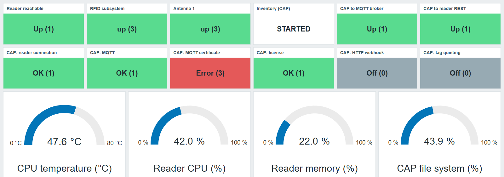
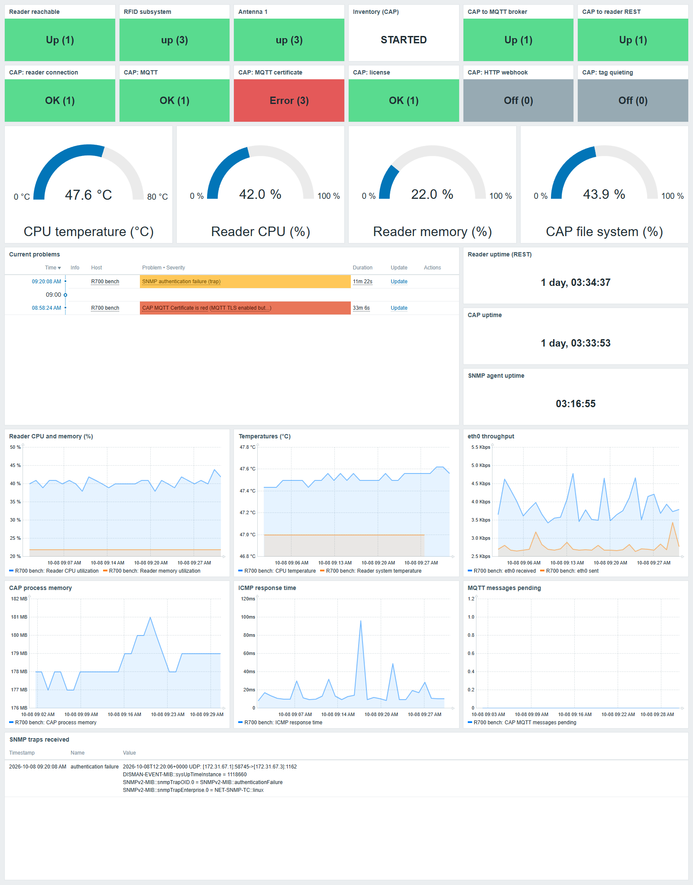

# SmartReader Zabbix Lab

## TL;DR

You need Docker, Python 3.10+, an R700 running the SmartReader CAP, its `root` password and the CAP's
admin login, and UDP port 162 open on this PC.

```bash
git clone https://github.com/suporterfid/smartreader-zabbix-lab.git && cd smartreader-zabbix-lab
pip install -r requirements.txt
cp .env.example .env            # edit: READER_HOST, READER_PASSWORD, CAP_PASSWORD, LAB_HOST_IP,
                                #       SNMP_COMMUNITY, SNMP_TRAP_COMMUNITY, R700_ANTENNAS
docker compose up -d            # Zabbix 7.0 at http://localhost:8080 (Admin / zabbix)
python reader_snmp.py enable    # reader: SNMP v2c read-only, traps to LAB_HOST_IP
python provision.py             # Zabbix: templates, triggers, host and dashboard
python status.py --wait         # first data, traps and open problems
```

Then open *Dashboards → R700 bench lab*. To put the reader back: `python reader_snmp.py revert`.
Step-by-step reader preparation, checks and troubleshooting: [docs/reader-setup.md](docs/reader-setup.md).

## About



A Docker Compose lab that runs **Zabbix 7.0 LTS** and monitors an **Impinj R700** RFID reader and the
**SmartReader CAP** running on it. One script builds the templates, triggers, host and dashboard through
the Zabbix API, so a fresh lab is ready in a few minutes and can be rebuilt at any time.

It was built to try out a Zabbix monitoring design for R700 fleets on a single bench reader before rolling
it out, and every item in it has collected data from a real reader (firmware 10.4.0, CAP 4.0.1.109).

## What it monitors

| Source | How | What you get |
|---|---|---|
| Reader | SNMP v2c polling | Reachability (ICMP), RFID subsystem status, per-antenna status, transmit power and energized time (low-level discovery), model, serial number and location for the host inventory |
| Reader | SNMP traps | Unexpected restart, authentication failure, planned shutdown, SNMP agent restart, anything else via a fallback item |
| SmartReader CAP | HTTPS 8443 | `/metrics` (MQTT connection and backlog, CAP and OS uptime, memory, disk, CPU temperature, `eth0` traffic), `/api/status/overview` (each dashboard component, discovered), `/api/getstatus` (inventory running or stopped), `/api/reader-rest-health` |
| Reader | REST API | Current CPU and memory utilization, temperature, uptime, firmware version, installed CAP image |

Three templates are created in the *Templates/SmartReader* group: **Impinj R700 by SNMP**,
**SmartReader CAP by HTTP** and **Impinj R700 REST API**. With one antenna attached, the host has about
80 items and 20 triggers, plus a dashboard named **R700 bench lab**.

## Dashboard

`provision.py` finishes by building the **R700 bench lab** dashboard. This is it on a bench R700
(firmware 10.4.0, CAP 4.0.1.109) after 30 minutes of collection:



From top to bottom:

- **Status tiles:** reachability, RFID subsystem, each discovered antenna, inventory state, and whether
  the CAP is connected to its MQTT broker and to the reader's REST API.
- **CAP components:** one tile per item of the CAP's own status page, coloured OK, Warning, Error or Off.
  The red *MQTT certificate* tile here is the CAP's one-way TLS false positive described below.
- **Gauges:** CPU temperature, reader CPU and memory, and the CAP's file system.
- **Current problems and uptimes.** The yellow problem is a test trap; the reader, CAP and SNMP agent
  uptimes sit on the right. The SNMP agent's is about three hours, against a day for the reader, because the agent restarted
  when the lab enabled SNMP.
- **Graphs:** reader CPU and memory, temperatures, `eth0` traffic, CAP memory, ICMP response time and
  MQTT backlog.
- **SNMP traps received**, newest first, with the full trap content.

## Requirements

- Docker with Compose v2. Tested on Docker Desktop with the WSL2 backend.
- Python 3.10 or later, with `pip install -r requirements.txt` (paramiko, for RShell over SSH).
- An R700 reachable from this machine, its `root` password, and the CAP's web admin login.
- UDP port 162 free on this machine and allowed through its firewall, so the reader's traps can arrive.

## Quick start

New to the reader side? [docs/reader-setup.md](docs/reader-setup.md) walks through preparing an R700
step by step: passwords, network checks, SNMP and traps, antenna ports, and how to undo it.

```bash
cp .env.example .env            # reader address, passwords, this PC's address (LAB_HOST_IP)
docker compose up -d            # Zabbix server, web UI, PostgreSQL, SNMP trap receiver
python reader_snmp.py enable    # SNMP v2c read-only + traps on the reader
python provision.py             # templates, triggers, host and dashboard
python status.py --wait         # waits for the first data, then lists items, traps and problems
```

Open http://localhost:8080 and sign in (the image default is `Admin` / `zabbix`), then go to
*Dashboards → R700 bench lab*. Add `&kiosk=1` to the dashboard URL for full screen.

To see a trap arrive, query the reader with a wrong community; it answers with an
`authenticationFailure` trap, which opens a problem and shows up in the dashboard's trap list:

```bash
snmpget -v2c -c wrong-community <reader> 1.3.6.1.2.1.1.5.0
```

## Files

| File | Purpose |
|---|---|
| `docker-compose.yml` | Zabbix 7.0 stack. Web UI and server port are bound to `127.0.0.1`; UDP 162 is open for the reader |
| `.env.example` | Settings template. Copy it to `.env`, which is git-ignored because it holds passwords |
| `provision.py` | Deletes and rebuilds the lab's templates, host and dashboard. History is lost on each run |
| `dashboard.py` | Rebuilds only the dashboard |
| `reader_snmp.py` | `enable`, `revert` or `show` the reader's SNMP settings through RShell |
| `status.py` | What Zabbix is collecting: unsupported items, latest values, traps, open problems, inventory |
| `probe.py` | Read-only look at the reader and the CAP without Zabbix |
| `docs/reader-setup.md` | Step-by-step tutorial for preparing a reader |
| `docs/images/` | Dashboard screenshots used in this README |
| `docs/snmpwalk-r700-fw10.4.0.txt` | Sample walk of a reader, serial number and host name removed |
| `mibs/` | Optional vendor MIBs (not included; see `mibs/README.md`) |

## What it changes on the reader

Only its SNMP settings, through RShell: SNMP v2c with a read-only community, SNMP writes disabled, v2c
traps to `LAB_HOST_IP`, and the Impinj `unexpectedrestart` trap. Everything else the lab does is read-only
(HTTP GETs and RShell `show` commands).

`python reader_snmp.py revert` runs `config snmp reset`, which returns SNMP to the factory default of
everything disabled. If your reader had its own SNMP configuration, save it first with
`python reader_snmp.py show`.

## Findings from a real reader

Checked on an R700 with firmware 10.4.0 and SmartReader CAP 4.0.1.109:

- **`sysUpTime` is the SNMP agent's uptime, not the reader's.** It restarts at zero whenever an SNMP
  setting changes, and `hrSystemUptime` is not available. Reboots are detected from the reader's OS
  uptime instead, which the CAP (`/proc/uptime`) and the REST API (`upTime`) both report.
- **SNMP tag counters stayed at zero** while inventory ran, globally and per antenna, and so did the
  reader's own `show rfid stat` counters. There may simply have been no tags in the field; check with
  tags in front of an antenna before alerting on them.
- **Transmit power is in hundredths of a dBm** (1550 = 15.5 dBm) and energized time in milliseconds.
- **Empty antenna ports report down (4)** when the active preset includes them. Set `R700_ANTENNAS` to
  the ports that have an antenna, or they raise "antenna down" for good.
- **The CAP reports `mqtt-cert` red** when MQTT TLS is on without a CA and a client certificate, even
  for one-way TLS where the connection works. The lab shows that as a problem.
- **`/metrics` has a side effect:** with the CAP's TCP socket output enabled and clients connected, each
  request sends every socket client a blank line.

## Traps and Docker Desktop

Zabbix matches a trap to a host by its source address. Docker Desktop rewrites that address to the
gateway of the lab's Docker network, so the compose file pins the network to `172.31.67.0/24` and
`provision.py` gives the host a second, trap-only SNMP interface on `172.31.67.1`. Every reader's traps
then look alike, which is fine for one reader and wrong for several.

On Docker Engine for Linux the source address is normally kept: set `TRAP_SOURCE_IP` in `.env` to the
reader's IP and re-run `provision.py`. If traps still do not match, the address Zabbix saw is on the
`UDP: [...]` line of each trap in:

```bash
docker compose exec zabbix-snmptraps tail /var/lib/zabbix/snmptraps/snmptraps.log
```

## Security notes

- `.env` holds the reader's root password and the CAP login. It is git-ignored; keep it that way.
  Inside Zabbix the passwords are stored as secret macros.
- SNMP v2c sends its community in clear text. Use the lab on a network you trust.
- Change the Zabbix `Admin` password if anyone else can reach port 8080. The compose file binds the web
  UI to `127.0.0.1` for that reason.

## Clean up

```bash
python reader_snmp.py revert    # SNMP back to factory defaults on the reader
docker compose down             # stop the lab, keep its data
docker compose down -v          # stop the lab and delete its data
```

## License

[MIT](LICENSE). Impinj and R700 are trademarks of Impinj, Inc. Vendor MIB files are not included.
